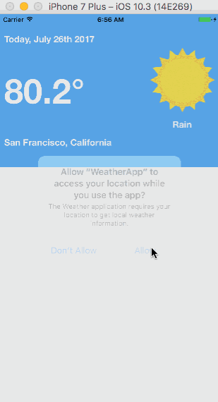

# WeatherApp

- This application leverages the OpenWeatherMap API to show current weather and
the weather forecast for your current location determined by Core Location.

- This application was written with MVC and SOLID principles in mind.

## Example Model

```
class Weathers {
    var _date: NSDate!
    var _weatherLabel: String!
    var _highTemp: String!
    var _lowTemp: String!

    enum DayOfWeek: Int {
        case Sunday = 1, Monday, Tuesday, Wednesday, Thursday, Friday, Saturday
    }

    var date: String {
        if _date == nil {
            _date = NSDate()
        }
        let dateFormatter = DateFormatter()
        dateFormatter.dateStyle = .long
        dateFormatter.timeStyle = .none
        let currentDay = Calendar.current.component(.weekday, from: _date as Date)
        return "\(String(describing: DayOfWeek(rawValue: currentDay)!)), \(dateFormatter.string(from: _date as Date))"
    }

    var weatherLabel: String {
        if _weatherLabel == nil {
            _weatherLabel = ""
        }
        return _weatherLabel
    }

    var highTemp: String {
        if _highTemp == nil {
            _highTemp = ""
        }
        return "\(_highTemp!)°"
    }

    var lowTemp: String {
        if _lowTemp == nil {
            _lowTemp = ""
        }
        return "\(_lowTemp!)°"
    }

    init (weatherItem: Dictionary<String, AnyObject>) {
        _date = NSDate(timeIntervalSince1970: weatherItem["dt"] as! TimeInterval)
        if let weatherDict = weatherItem["weather"] as? [Dictionary<String, AnyObject>] {
            _weatherLabel = weatherDict[0]["main"]! as! String
        }
        _highTemp = Weathers.convertTemp(currentTemp: weatherItem["temp"]?["max"] as! Double)
        _lowTemp = Weathers.convertTemp(currentTemp: weatherItem["temp"]?["min"] as! Double)
    }

    class func convertTemp(currentTemp: Double) -> String {
        return String(round(10*(1.8*(currentTemp-273)+32)/10))
    }
}
```



*EricDev 2017
